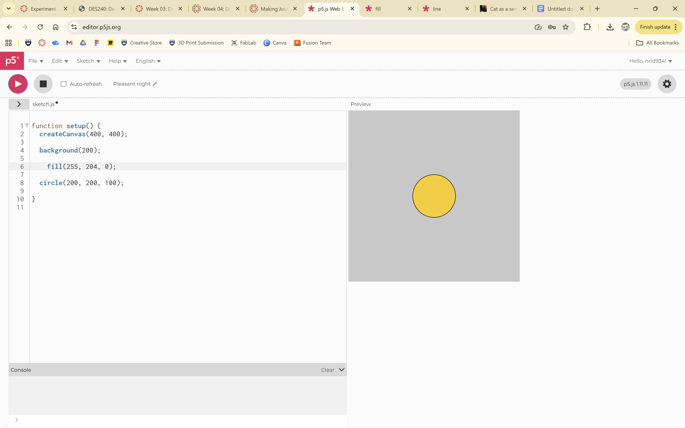

# Week 02

[← Back to Home](../index.md)

## Documentation 

## Activity 1: Drawing with code

Experimenting with circles:

### Creating a sketch with multiple shapes:

## Activity 2: Making an Interactive control

The first interactive control that I had explored was a drop-down select menu which could change the colour of the box. The original colour that started the action was red, which could then either be changed into green, blue or yellow. 

The second interactive element that I had tried was the slider. In this case, the slider could be used to alter the size  of the circle in the centre. Dragging the slider right made the red circle bigger, however sliding towards the leftmade it smaller. There were two extremes (smallest and biggest) which capped the shape from going either bigger or smaller.

### Activity 3: Coding an interactive sketch

I listed numerical data through rating the different iftar experiences,I also categorised the data to show which crowd of people I was spending time with and what cousine was taken to account. The aspects that I chose to represent were the crowd and the 

Attempting to make the p5.js sketch:

My plan was to create a sketch which could potentially symbolise the time of day through a greyscale slider. With that, I wanted elements to show which represented what food/drink could be taken while fasting (if one was) and at the iftar time, I wanted to represent different kinds of food which couldbe eaten like the different foods I had during the period of 5 days. As the meals altered per day, I would have wanted to include a selection element below the canvas to select what day it was based on my hand written data. However due to time constraints and my slowed learning, I was unable to achieve the result that I wanted and thus meaning I was unable to find how to combine multiple, interactive elements. 

Incooperating interaction in this case could have represented an element of time, both the hours of the day and of the day itself. It would be more specific, and at the pace of the user. More details could be shown that could not have been included before, had the more specific details like hours of the day been shown before, the sketch could have risked being overcomplicated and less userfriendly to observe.

The structure of my data involved both numerical and visual data, therefore the drawing would have to account for both. The numerical values tended to relate to time circumstances and food ratings whereas the visual had shown the kind of food that was eaten. The interactions relatedby following a similar linear structure (through the slider) and would have followed similar visual design as the original dataset.

When the user changes something in the drawing, it is not immediate, rather it could have been gradual or fast; essentially at their own pace.

What data and visual aspects from Experiment 1 did you choose to work with, and why?
I would have wanted to work with the food data and the data for the time of day. I would have wanted to create a drawing that could be understood simply by many people. With that, any potentially new information like the timing of eating in Ramadan, could be more easily digested by users who could have been 

Whilst browsing the p5.js references, I came across the greyscale fade slider. Automatically, it reminded me of the different parts of the day with the sun's placement and shadows created. I also wanted to include all five days from my dataset, and I remembered the box selection tool which allowed me to change the colour of the box. In the end, adding a simple shape to the fade slider canvas was too difficult.

Through interacting with the drawing, the user could potentially learn more about the logistics of fasting in Islam. Often, people may get confused about whether Muslims fast for the whole 30 days or parts of each day. This drawingapproach could have also shown how each day works and how it does not harm most Muslims (some are medically excused from fasting due the possibility of risk). 

I did not use vibe coding in the process. I did however, make use of the p5.js references.

With more time, I would have liked to find out how to include more than one interactive element to maximise the effects of the drawing, and to use more elements in general. Perhaps I could have also thought through the interactions more and indicating more clearer about how to ensure the day gets picked first instead of the timing. To achieve this, I could perhaps use teachings of visual communication and how (in Aotearoa) people tend to read from left to right, this can be used to our advantage by ensuring potential important information is placed accordingly or perhaps with high contrast.

