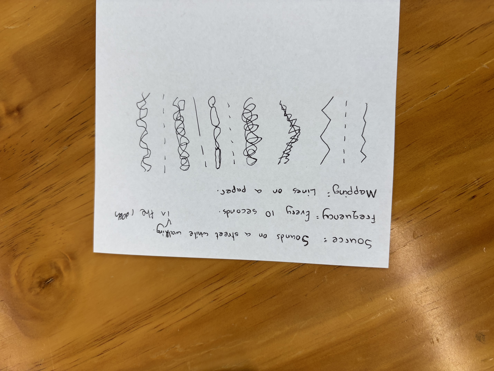
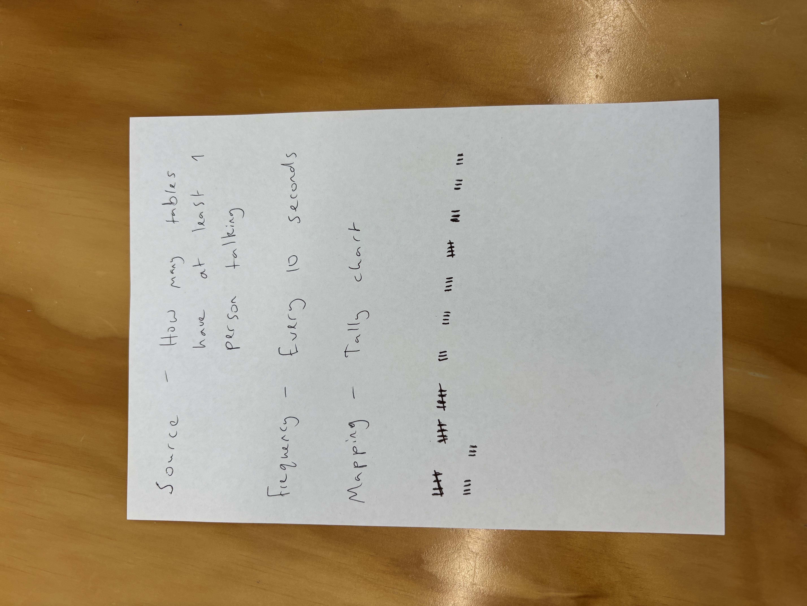

# Week 03

[← Back to Home](../index.md)

## Documentation 

## Activity 1: Explore with cURL

## Activity 2: Weather Visualisation

### Activity 3: Design and Execute a Data Protocol

In pairs, design a data protocol: a set of rules for translating a live data source. This is the analogue equivalent of an API: a defined set of rules for requesting and receiving data.

Our protocol included the tasks of checking how many tables have been talking at a time window of every 10 seconds. Each table that had at least one person speaking could be represented with a tally marking.

Below shows an image of how the activity turned out for my group:

Below is a picture of the sheet that my group had gotten from another group:

When time is up, compare your output with what the designers intended. Did you interpret the rules as they expected? Where was the protocol ambiguous? What surprised you about the result?

The instructions was ambiguious with the data collection method,  this group had mentioned to use lines on paper. My team had iterpreted this task as drawing lines ofpaper in accordance to the sounds we were hearing.

### Independant Study

(Cat API)

<iframe
  src="https://editor.p5js.org/nrid934/full/4r3r1iOOy"
  width="400"
  height="400">
</iframe>

How do you map data values to visual properties (colour, size, position, shape, movement)?

What does the visualisation reveal about the data that numbers alone cannot?

How does the sketch change over time? What is the relationship between the data's rhythm and the visual rhythm?

Did you take a digital or analogue/physical approach? Why?
I chose to take a digital approach to the activity as a means of convienience as I did not have enough time to plan and create a physical prototype. 

What live data source did you work with, and how did you access it?

How did you decide on the mapping between data and visual/material form?

What does your work reveal or communicate about the data?

Did you use vibe coding, LLMs, or other tools in your process? What did you learn?

How does your work relate to the practitioner examples discussed in class (e.g. David Bowen, Conditional Design, Nathalie Miebach)?

What would you develop further with more time?
